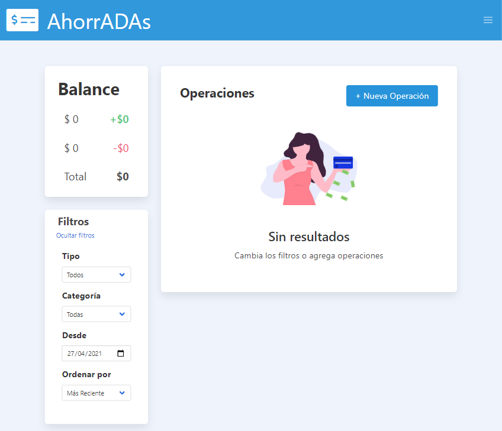

# Ahorradas por Silvi Bordon 💲💲

Aplicación que permite llevar un registro con los datos de los gastos, ganancia y balance de los mismos.
Proyecto realizado como evaluación final del quinto modulo del curso desarrollo FrontEnd, utilizando **JavaScript**.

 

## 👀 Haciendo click [aquí](https://silbordon.github.io/ProyectoAhorradasSilvi/) puedes verlo andar y tener control de tus propias finanzas 👩🏻‍💻.

 

📌 ***Este proyecto utiliza las siguientes dependencias:.*** 

📁 [Bulma](https://bulma.io/)
 

📁  [uuidjs](https://github.com/uuidjs/uuid#readme
)

  

---
Hecho por mucho amor por mi ❤